# VidIngest - Data Model

- **Primary packages**: `com.tradinglabs.vidingest.pipeline.domain`, `com.tradinglabs.vidingest.videos.domain`,
  `com.tradinglabs.vidingest.core.transcription.domain`, `com.tradinglabs.vidingest.search.domain`,
  `com.tradinglabs.vidingest.core.{diarization,frames,ocr,fusion,knowledge}.domain`
- **Last reviewed**: 2026-08-27
- **Status**: stable

## Quickstart (for agents)

VidIngest uses PostgreSQL with the pgvector extension. Schema is managed via Liquibase. All tables use the `vidingest_` prefix.

Every timestamp column is `TIMESTAMPTZ` and every entity field is `OffsetDateTime` set with
`OffsetDateTime.now(ZoneOffset.UTC)`, so the stored instant and the JSON the API emits are the
same regardless of the JVM's zone. They were `LocalDateTime` until 2026-08-27, which made both
depend on the container's `-Duser.timezone=UTC` and shifted every age by the offset when the
server ran on a host.

**Implementation pointers**

| File | Role |
|------|------|
| `applications/vidingest/vidingest-server/src/main/resources/db/changelog/changesets/` | Liquibase changesets (source of truth for schema): `001-core-pipeline.sql`, `002-youtube-channels.sql`, `003-knowledge-extraction.sql`, `004-run-item-lease.sql`, `005-run-skip-phases.sql`, `006-index-cleanup.sql`, `007-speaker-labels.sql` |
| `applications/vidingest/vidingest-server/src/main/resources/db/changelog/db.changelog-master.yaml` | Liquibase master changelog |
| `applications/vidingest/vidingest-server/src/main/java/com/tradinglabs/vidingest/config/LiquibaseConfig.java` | Explicit Liquibase bean wiring |

## Entity relationship diagram

Mermaid source: `diagrams/mermaid/vidingest-data-model.mmd`

## Entities

### `vidingest_pipeline_runs` (PipelineRun)

Tracks the lifecycle of a full ingestion pipeline execution (a pipeline run).

In batch mode, **one** `PipelineRun` contains **many** per-URL run-items (`vidingest_pipeline_run_items`). The run’s `status` is an aggregate of its items.

| Column | Type | Constraints | Description |
|--------|------|-------------|-------------|
| `id` | UUID | PK | Auto-generated |
| `status` | VARCHAR(50) | NOT NULL | `PENDING`, `IN_PROGRESS`, `COMPLETED`, `FAILED`, `CANCELLED` |
| `phase` | VARCHAR(50) | nullable | Pipeline phase (`CREATED`, `METADATA`, `DOWNLOAD`, `PERSIST`, `TRANSCRIBE`, `CONTEXT`, `DONE`) |
| `phase_updated_at` | TIMESTAMPTZ | nullable | Timestamp of last phase update |
| `error_code` | VARCHAR(80) | nullable | Typed error code (e.g., `DUPLICATE_VIDEO`) |
| `error` | TEXT | nullable | Error message if the pipeline run failed |
| `video_url` | TEXT | nullable | Legacy single-video runs only. For batch runs, URL is stored on `vidingest_pipeline_run_items.url` |
| `skip_phases` | TEXT | nullable | Optional phases this run opts out of, comma-separated in enum order (`PhaseSetConverter`). NULL and `''` both mean nothing skipped. Read on retry: a retry request that omits `skipPhases` reuses this set, and `prepareRetry` writes back the set the new attempt runs with |
| `created_at` | TIMESTAMPTZ | NOT NULL | Set on persist |
| `updated_at` | TIMESTAMPTZ | NOT NULL | Updated on every save |

JPA entity: `com.tradinglabs.vidingest.pipeline.domain.PipelineRun`
Repository: `com.tradinglabs.vidingest.pipeline.repo.PipelineRunRepository`

### `vidingest_pipeline_run_items` (PipelineRunItem)

One row per submitted URL within a batch `PipelineRun`. Tracks per-item status/phase and optionally links to the produced `Video`.

| Column | Type | Constraints | Description |
|--------|------|-------------|-------------|
| `id` | UUID | PK | Auto-generated |
| `pipeline_run_id` | UUID | FK -> vidingest_pipeline_runs, NOT NULL, ON DELETE CASCADE | Owning pipeline run |
| `url` | TEXT | NOT NULL | Submitted URL (unique per run) |
| `status` | VARCHAR(50) | NOT NULL | `PENDING`, `IN_PROGRESS`, `COMPLETED`, `FAILED`, `CANCELLED` |
| `phase` | VARCHAR(50) | nullable | Pipeline phase (`CREATED`, `METADATA`, `DOWNLOAD`, `PERSIST`, `TRANSCRIBE`, `CONTEXT`, `DONE`) |
| `phase_updated_at` | TIMESTAMPTZ | nullable | Timestamp of last phase update |
| `error_code` | VARCHAR(80) | nullable | Typed error code (e.g., `DUPLICATE_VIDEO`) |
| `error` | TEXT | nullable | Error message if the run item failed |
| `video_id` | UUID | FK -> vidingest_videos, nullable, ON DELETE SET NULL | Produced video (when available) |
| `created_at` | TIMESTAMPTZ | NOT NULL | Set on persist |
| `updated_at` | TIMESTAMPTZ | NOT NULL | Updated on every save |

JPA entity: `com.tradinglabs.vidingest.pipeline.domain.PipelineRunItem`
Repository: `com.tradinglabs.vidingest.pipeline.repo.PipelineRunItemRepository`

### `vidingest_videos` (Video)

Core entity representing a downloaded video with its metadata.

| Column | Type | Constraints | Description |
|--------|------|-------------|-------------|
| `id` | UUID | PK | Auto-generated |
| `pipeline_run_id` | UUID | FK -> vidingest_pipeline_runs, ON DELETE SET NULL | Owning pipeline run |
| `source` | VARCHAR(50) | NOT NULL | Platform: `youtube`, `vimeo`, `unknown` |
| `source_video_id` | VARCHAR(255) | NOT NULL, UNIQUE(source, source_video_id) | Platform-specific video ID |
| `title` | TEXT | nullable | Video title |
| `description` | TEXT | nullable | Video description |
| `channel_name` | VARCHAR(255) | nullable | Channel/uploader name |
| `duration_seconds` | INT | nullable | Video duration |
| `published_at` | TIMESTAMPTZ | nullable | Original publish date |
| `downloaded_at` | TIMESTAMPTZ | nullable | When the video was downloaded |
| `file_path` | TEXT | nullable | Absolute path to downloaded file |
| `metadata` | JSONB | nullable | Full yt-dlp metadata stored as JSON |
| `status` | VARCHAR(50) | NOT NULL | `PENDING`, `DOWNLOADING`, `DOWNLOADED`, `TRANSCRIBING`, `PROCESSING`, `COMPLETED`, `FAILED` |
| `created_at` | TIMESTAMPTZ | NOT NULL | Set on persist |
| `updated_at` | TIMESTAMPTZ | NOT NULL | Updated on every save |

**Indexes**: channel_name, status, pipeline_run_id
(`source` needs none — it is the leftmost column of the unique constraint below. The `metadata`
GIN index was dropped in `006`: nothing queries JSONB by content.)
**Unique constraint**: `(source, source_video_id)` prevents duplicate downloads

JPA entity: `com.tradinglabs.vidingest.videos.domain.Video`
Repository: `com.tradinglabs.vidingest.videos.repo.VideoRepository`

### `vidingest_youtube_channels` (YoutubeChannel)

Stores a user-managed list of YouTube channels to sync and browse over REST.

| Column | Type | Constraints | Description |
|--------|------|-------------|-------------|
| `id` | UUID | PK | Auto-generated |
| `channel_url` | TEXT | NOT NULL, UNIQUE | User-provided YouTube channel URL (e.g. `https://www.youtube.com/@handle`) |
| `display_name` | VARCHAR(255) | nullable | Optional UI label |
| `status` | VARCHAR(50) | NOT NULL | `NEW`, `SYNCING`, `READY`, `ERROR`, `DISABLED` |
| `metadata` | JSONB | nullable | Full yt-dlp channel/playlist JSON payload (bounded by playlistLimit) |
| `last_sync_attempt_at` | TIMESTAMPTZ | nullable | Last sync attempt time |
| `last_sync_success_at` | TIMESTAMPTZ | nullable | Last successful sync time |
| `last_error` | TEXT | nullable | Last sync error message (if any) |
| `created_at` | TIMESTAMPTZ | NOT NULL | Set on persist |
| `updated_at` | TIMESTAMPTZ | NOT NULL | Updated on every save |

JPA entity: `com.tradinglabs.vidingest.youtube.domain.YoutubeChannel`
Repository: `com.tradinglabs.vidingest.youtube.repo.YoutubeChannelRepository`

### `vidingest_youtube_channel_videos` (YoutubeChannelVideo)

Represents the discovered “available videos” list for a synced channel. This is a discovery catalog; it does not imply the video has been ingested.

| Column | Type | Constraints | Description |
|--------|------|-------------|-------------|
| `id` | UUID | PK | Auto-generated |
| `channel_id` | UUID | FK -> vidingest_youtube_channels, NOT NULL, ON DELETE CASCADE | Owning channel |
| `youtube_video_id` | VARCHAR(64) | NOT NULL | YouTube video id (e.g. `dQw4w9WgXcQ`) |
| `title` | TEXT | nullable | Video title (from yt-dlp flat playlist discovery) |
| `published_at` | TIMESTAMPTZ | nullable | Publish date if present (`upload_date`/`timestamp`) |
| `watch_url` | TEXT | NOT NULL | Canonical watch URL (`https://www.youtube.com/watch?v=<id>`) |
| `metadata` | JSONB | nullable | Per-entry discovery JSON payload |
| `first_seen_at` | TIMESTAMPTZ | NOT NULL | When this entry first appeared in our catalog |
| `last_seen_at` | TIMESTAMPTZ | NOT NULL | When this entry was last observed during sync |
| `created_at` | TIMESTAMPTZ | NOT NULL | Set on persist |
| `updated_at` | TIMESTAMPTZ | NOT NULL | Updated on every save |

**Unique constraint**: `(channel_id, youtube_video_id)` ensures one row per channel/video pair.

JPA entity: `com.tradinglabs.vidingest.youtube.domain.YoutubeChannelVideo`
Repository: `com.tradinglabs.vidingest.youtube.repo.YoutubeChannelVideoRepository`

### `vidingest_transcriptions` (Transcription)

Stores transcription output for a video. Populated when the ingestion pipeline runs the TRANSCRIBE phase (it is not named in the run's `skipPhases`).

| Column | Type | Constraints | Description |
|--------|------|-------------|-------------|
| `id` | UUID | PK | Auto-generated |
| `video_id` | UUID | FK -> vidingest_videos, NOT NULL, ON DELETE CASCADE | Parent video |
| `language` | VARCHAR(10) | nullable | Language code (e.g., `en`) |
| `full_text` | TEXT | nullable | Complete transcription text |
| `provider` | VARCHAR(50) | nullable | Transcription provider (e.g., `whisper`) |
| `status` | VARCHAR(50) | NOT NULL | Reuses `VideoStatus` enum |
| `created_at` | TIMESTAMPTZ | NOT NULL | Set on persist |
| `updated_at` | TIMESTAMPTZ | NOT NULL | Updated on every save |

JPA entity: `com.tradinglabs.vidingest.core.transcription.domain.Transcription`
Repository: `com.tradinglabs.vidingest.core.transcription.repo.TranscriptionRepository`

### `vidingest_transcription_segments` (TranscriptionSegment)

Timestamped segments within a transcription.

| Column | Type | Constraints | Description |
|--------|------|-------------|-------------|
| `id` | UUID | PK | Auto-generated |
| `transcription_id` | UUID | FK -> vidingest_transcriptions, NOT NULL, ON DELETE CASCADE | Parent transcription |
| `start_seconds` | FLOAT | NOT NULL | Segment start time |
| `end_seconds` | FLOAT | NOT NULL | Segment end time |
| `text` | TEXT | NOT NULL | Segment text content |
| `created_at` | TIMESTAMPTZ | NOT NULL | Set on persist |

**Indexes**: (transcription_id, start_seconds), (start_seconds, end_seconds), speaker_id

JPA entity: `com.tradinglabs.vidingest.core.transcription.domain.TranscriptionSegment`
Repository: `com.tradinglabs.vidingest.core.transcription.repo.TranscriptionSegmentRepository`

### `vidingest_context_chunks` (ContextChunk)

Text chunks with vector embeddings for semantic search. Populated by the pipeline `CONTEXT` phase (when enabled) or via the manual regenerate endpoint (`POST /api/v1/videos/{id}/context/regenerate`).

| Column | Type | Constraints | Description |
|--------|------|-------------|-------------|
| `id` | UUID | PK | Auto-generated |
| `video_id` | UUID | FK -> vidingest_videos, NOT NULL, ON DELETE CASCADE | Parent video |
| `chunk_index` | INT | NOT NULL, UNIQUE(video_id, chunk_index) | Order within the video |
| `content` | TEXT | NOT NULL | Chunk text content |
| `embedding` | VECTOR(1536) | nullable | pgvector embedding (1536 dimensions) |
| `created_at` | TIMESTAMPTZ | NOT NULL | Set on persist |

**Indexes**: embedding (HNSW, `vector_cosine_ops`, partial on `embedding IS NOT NULL`)
(`video_id` needs none — leftmost column of the unique constraint below.)
**Unique constraint**: `(video_id, chunk_index)` ensures ordered chunks per video

The `findSimilarChunks` repository method uses pgvector's `<->` operator for nearest-neighbor search.

JPA entity: `com.tradinglabs.vidingest.search.domain.ContextChunk`
Repository: `com.tradinglabs.vidingest.search.repo.ContextChunkRepository`

## Status enums

### VideoStatus

Used by `Video` and `Transcription` entities.

| Value | Meaning |
|-------|---------|
| `PENDING` | Initial state |
| `DOWNLOADING` | Download in progress |
| `DOWNLOADED` | Download complete |
| `TRANSCRIBING` | Transcription in progress |
| `PROCESSING` | Context/embedding generation in progress |
| `COMPLETED` | All pipeline phases done |
| `FAILED` | Pipeline failed |

### RunStatus

Used by `PipelineRun`.

| Value | Meaning |
|-------|---------|
| `PENDING` | Pipeline run created, not started |
| `IN_PROGRESS` | Pipeline run running |
| `COMPLETED` | Pipeline run finished successfully |
| `FAILED` | Pipeline run failed |
| `CANCELLED` | Pipeline run was cancelled |

## Liquibase migrations

The master changelog is at `db/changelog/db.changelog-master.yaml` and includes changesets from the `changesets/` subdirectory.

Notable changesets (consolidated 2026-06-01):

- `001-core-pipeline.sql`: pgvector extension + core schema (`vidingest_pipeline_runs`, `vidingest_videos`, `vidingest_transcriptions`, `vidingest_transcription_segments`, `vidingest_context_chunks`, `vidingest_pipeline_run_items`, `vidingest_pipeline_run_item_events`)
- `002-youtube-channels.sql`: channel sync catalog (`vidingest_youtube_channels`, `vidingest_youtube_channel_videos`)
- `003-knowledge-extraction.sql`: multi-modal knowledge tables (`vidingest_speakers`, `vidingest_video_frames`, `vidingest_ocr_results`, `vidingest_multimodal_segments`, `vidingest_knowledge_units`) and the `vidingest_transcription_segments.speaker_id` column
- `004-run-item-lease.sql`: `lease_owner` / `lease_expires_at` on `vidingest_pipeline_run_items`
- `005-run-skip-phases.sql`: `skip_phases` on `vidingest_pipeline_runs`
- `006-index-cleanup.sql`: drops seven single-column indexes that were leftmost-prefix subsets of
  an existing composite, plus all three `metadata` GIN indexes. A leftmost-prefix duplicate looks
  used in `pg_stat_user_indexes` because the planner prefers the narrower of two interchangeable
  indexes — verified by dropping them against production data and re-planning every query
- `007-speaker-labels.sql`: `vidingest_multimodal_segments.speaker_ids UUID[]` becomes
  `speaker_labels TEXT[]`, because DIARIZE recreates speaker rows under new uuids and the array
  had no FK to catch the stale reference

The `LiquibaseConfig` bean explicitly wires `SpringLiquibase` to ensure migrations run at startup.

Migrations create the pgvector extension (`CREATE EXTENSION IF NOT EXISTS vector`) before creating tables.

## Invariants

- A `(source, source_video_id)` pair is unique across all videos
- A `(pipeline_run_id, url)` pair is unique across all pipeline run items
- A `(video_id, chunk_index)` pair is unique across all context chunks
- `created_at` is set once on persist and never updated
- `updated_at` is refreshed on every save via `@PreUpdate`
- Deleting a video cascades to its transcriptions, segments, and context chunks
- Deleting a pipeline run sets `pipeline_run_id` to NULL on associated videos (SET NULL)
- Deleting a pipeline run cascades to its pipeline run items (CASCADE)

## M2–M8 knowledge-extraction entities (changeset `003-knowledge-extraction.sql`)

The following tables back the multi-modal knowledge-extraction phases. All use the
`vidingest_` prefix and cascade on `video_id` (or on the parent frame, which itself
cascades on `video_id`). See
[Knowledge Extraction](VidIngest%20-%20Knowledge%20Extraction.md) for usage.

### `vidingest_speakers` (Speaker)
Pyannote-identified speakers per video. One row per `(video_id, label)` pair. Includes
an optional `embedding_voiceprint vector(192)` x-vector for future cross-video re-id.

### `vidingest_transcription_segments.speaker_id`
Nullable FK on the existing transcription segments table linking each segment to a
speaker. `ON DELETE SET NULL` so removing speakers doesn't cascade-delete transcripts.

### `vidingest_video_frames` (VideoFrame)
One row per keyframe sampled from a video. Stores timestamp, frame index, on-disk file
path, and the `SamplingReason` enum (`INTERVAL` / `SCENE_CHANGE` / `KEYFRAME`).

### `vidingest_ocr_results` (OcrResult)
PaddleOCR detections per frame: text, confidence, JSONB bbox polygon, language. FK to
`vidingest_video_frames` with cascading delete.

### `vidingest_multimodal_segments` (MultimodalSegment)
Fused per-window view of transcript + speakers + OCR. One row per fusion window
(default 30s with 5s overlap). `speaker_labels` is a PostgreSQL `text[]` of pyannote labels
(`SPEAKER_00`, ...) rather than speaker uuids — DIARIZE wipes and recreates every speaker row, so
an id array went stale on a re-run with no FK to catch it, while `UNIQUE (video_id, label)` makes
the label the stable natural key. `transcript_text` and `ocr_text` are independently nullable.

### `vidingest_knowledge_units` (KnowledgeUnit)
LLM-extracted typed knowledge units (`ENTITY` / `TOPIC` / `SUMMARY` / `CLAIM` / `QUESTION`)
with `vector(1536)` embeddings and ivfflat index for semantic search. JSONB `metadata`
holds salience, source segment indices, prompt version, chat model name.

## Related pages

- [VidIngest](VidIngest.md)
- [VidIngest - Config and Runtime](VidIngest%20-%20Config%20and%20Runtime.md)
- [VidIngest - Knowledge Extraction](VidIngest%20-%20Knowledge%20Extraction.md)
