# VidIngest - Download Pipeline

- **Primary packages**: `com.tradinglabs.vidingest.download.service`, `com.tradinglabs.vidingest.download.util`
- **Last reviewed**: 2026-08-27
- **Status**: stable

## Quickstart (for agents)

The download pipeline wraps yt-dlp (external process) to extract video metadata and download video files. It supports two modes: database-backed and disk-only.

**Implementation pointers**

| File | Role |
|------|------|
| `applications/vidingest/vidingest-server/src/main/java/com/tradinglabs/vidingest/core/download/service/VideoDownloadService.java` | Download orchestration, metadata extraction, file management |
| `applications/vidingest/vidingest-server/src/main/java/com/tradinglabs/vidingest/core/download/service/MetadataService.java` | Maps yt-dlp JSON to `Video` entity and persists |
| `applications/vidingest/vidingest-server/src/main/java/com/tradinglabs/vidingest/core/download/util/YtDlpCommandBuilder.java` | Builds yt-dlp command lines from `VideoDownloadConfig` |
| `applications/vidingest/vidingest-server/src/main/java/com/tradinglabs/vidingest/core/download/util/YtDlpExecutor.java` | Executes yt-dlp via Apache Commons Exec |
| `applications/vidingest/vidingest-server/src/main/java/com/tradinglabs/vidingest/core/download/util/MetadataExtractor.java` | Static helpers to pull fields from yt-dlp JSON |
| `applications/vidingest/vidingest-server/src/main/java/com/tradinglabs/vidingest/core/download/util/FileSystemHelper.java` | Path sanitization, directory creation, file discovery |

## Architecture



Mermaid source: `diagrams/mermaid/vidingest-download-pipeline.mmd`

## Download modes

### Database mode (default)

1. `VideoDownloadService.extractMetadata(url)` runs `yt-dlp --dump-json --no-download` and parses the JSON output
2. `VideoDownloadService.downloadVideoToDisk(url, metadata)` downloads the video file into a channel folder structure under `{videoPath}/{channelName}/`
3. `MetadataService.processMetadata(metadata, filePath)` creates or updates a `Video` entity with all extracted fields
4. `VideoDownloadService.saveMetadataToDisk(metadata, filePath)` writes a companion `.metadata.json` next to the downloaded file

Database mode and disk-only mode now share the same on-disk layout; the difference is whether the `Video` is persisted to PostgreSQL.

### Disk-only mode

1. Same metadata extraction as database mode
2. `VideoDownloadService.downloadVideoToDisk(url, metadata)` downloads into a channel folder structure:
   - Path: `{videoPath}/{channelName}/YYYYMMDD.title.{ext}`
   - Channel name is sanitized for filesystem safety
   - Date comes from `upload_date`, `release_date`, or `timestamp` in metadata
3. `VideoDownloadService.saveMetadataToDisk(metadata, filePath)` writes a companion `.metadata.json` file

No database interaction occurs in disk-only mode.

## yt-dlp integration

### Command construction

`YtDlpCommandBuilder` reads all options from `VideoDownloadConfig` and builds the command line:

**Metadata extraction command**

```
yt-dlp --dump-json --no-download --no-warnings --quiet <URL>
```

**Download command** (example with defaults)

```
yt-dlp --format bestvideo+bestaudio --merge-output-format mp4 \
       --output <outputTemplate> --restrict-filenames --retries 3 \
       --embed-metadata <URL>
```

Additional flags are appended based on config: subtitles, thumbnails, concurrent fragments, audio post-processing, etc.

### Command execution

`YtDlpExecutor` uses Apache Commons Exec (`DefaultExecutor`) to run yt-dlp commands.

- **`executeForOutput(cmdLine, timeoutSeconds)`**: Captures stdout as a string. Used for metadata extraction.
- **`executeDownload(cmdLine, workingDir, timeoutSeconds, streamProgress)`**: Runs with working directory, watchdog timeout, and optional real-time progress streaming.

Both methods capture stderr separately and throw `IOException` with the exit code and error output on failure.

If a watchdog kills the process, the thrown message is `yt-dlp timed out after N seconds`.

### JSON parsing

`VideoDownloadService.cleanJsonOutput()` strips non-JSON lines (warnings, progress messages) from yt-dlp output before parsing. It finds the first line starting with `{` or `[` and collects from there.

## Timeout and progress behavior

- Timeout is controlled by `vidingest.download.timeout-seconds`.
- `0` disables the timeout.
- CLI users can enable streaming progress with `download --progress true`.
- MCP flows always run non-interactive (progress disabled), but still respect timeout settings.

## Metadata mapping

`MetadataExtractor` pulls these fields from the yt-dlp JSON:

| Video field | yt-dlp JSON field(s) | Fallback |
|-------------|---------------------|----------|
| `source` | `extractor` (normalized) | `webpage_url` domain detection, then `"unknown"` |
| `sourceVideoId` | `id` | `display_id`, then `webpage_url` |
| `title` | `title` | null |
| `channelName` | `channel`, `uploader`, `channel_name`, `uploader_id` | null |
| `description` | `description` | null |
| `durationSeconds` | `duration` | null |
| `publishedAt` | `upload_date` (YYYYMMDD), `release_date`, `timestamp` (epoch) | null |
| `metadata` | entire JSON map stored as JSONB | - |

## File naming conventions

| Mode | Pattern | Example |
|------|---------|---------|
| Database + disk-only | `{channelName}/YYYYMMDD.{title}.{ext}` | `RickAstley/20091025.never-gonna-give-you-up.mp4` |
| Metadata | `YYYYMMDD.{title}.metadata.json` | `20091025.never-gonna-give-you-up.metadata.json` |

Filenames are sanitized by `FileSystemHelper.sanitizeFilename()` to remove problematic characters.

## Storage paths

Resolved in order of priority:

1. `vidingest.storage.video-path` from properties
2. `ProjectPathResolver` auto-detection: `{projectRoot}/package/vidingest/videos`
3. Environment variables (Spring relaxed binding): `VIDEO_KNOWLEDGE_ROOT`, `VIDINGEST_STORAGE_VIDEO_PATH`
4. Fallback: current working directory

## Transcript artifacts

When the TRANSCRIBE phase runs (it is not named in the run's `skipPhases`), VidIngest writes transcript artifacts to:

The same directory as the downloaded video file under `package/vidingest/videos/` (local dev) or `/data/videos` (container).

Files use the same base name as the video file (without extension):

- `<videoFileBase>.whisper.json`
- `<videoFileBase>.whisper.txt`

Moved here from the overview page — these sit beside the downloaded file, so they belong with the naming and storage rules above.

## Beyond DOWNLOAD: the full ingestion pipeline

The phases described above (`METADATA → DOWNLOAD → PERSIST → TRANSCRIBE → CONTEXT`) are
the download-and-transcribe core, and what a default local run does. Five further phases sit
between `TRANSCRIBE` and `CONTEXT`, each off unless its `vidingest.<phase>.enabled` says otherwise:

```
METADATA → DOWNLOAD → PERSIST → TRANSCRIBE → DIARIZE → FRAME_SAMPLE → OCR → FUSE → KNOWLEDGE → CONTEXT
```

All new phases are disabled by default and individually opt-in via config (master
switch) and per-run skip flags. See
[Knowledge Extraction](VidIngest%20-%20Knowledge%20Extraction.md) for the
detailed responsibility, wire contract, and configuration of each new phase and the
sidecars they depend on (`diarize-asr`, `paddleocr-server`, plus the `llm` runtime for the chat
model).

## Related pages

- [VidIngest](VidIngest.md)
- [VidIngest - Config and Runtime](VidIngest%20-%20Config%20and%20Runtime.md)
- [VidIngest - Knowledge Extraction](VidIngest%20-%20Knowledge%20Extraction.md)
