# VidIngest (server + MCP + CLI)

- **Owner**: TradingLabs Platform
- **Last reviewed**: 2026-05-13
- **Status**: stable
- **Applies to**: `vidingest-server`, `vidingest-mcp`, `vidingest-cli`, `vidingest-client`, `vidingest-api`
- **Capabilities**: download + transcription + semantic chunk search (stable);
  speaker diarization + frame sampling + OCR + multimodal fusion + LLM-driven knowledge
  extraction (M2–M8, disabled by default — see
  [Knowledge Extraction](VidIngest%20-%20Knowledge%20Extraction.md))
- **Source of truth**:
  - Server: `applications/vidingest/vidingest-server/`
  - MCP: `applications/vidingest/vidingest-mcp/`
  - CLI: `applications/vidingest/vidingest-cli/`
  - Client: `applications/vidingest/vidingest-client/`

## Quickstart (for agents)

VidIngest is split into:

- **`vidingest-server`**: Spring MVC server that runs the ingestion pipeline, owns the DB + Liquibase schema, executes `yt-dlp`, exposes **REST**.
- **`vidingest-mcp`**: Standalone Spring MVC MCP server (SSE) that delegates to `vidingest-server` via `vidingest-client`.
- **`vidingest-cli`**: Spring Shell CLI (remote-only) that calls the server over HTTP via `vidingest-client`.
- **`vidingest-client`**: typed `RestClient` wrapper used by the CLI (and any future Java consumers).

**Entrypoints**

| Area | Path |
|------|------|
| Server main class | `applications/vidingest/vidingest-server/src/main/java/com/tradinglabs/vidingest/VidIngestApp.java` |
| Server pipeline service | `applications/vidingest/vidingest-server/src/main/java/com/tradinglabs/vidingest/pipeline/service/PipelineService.java` |
| Server config | `applications/vidingest/vidingest-server/src/main/resources/application.properties` |
| Server schema | `applications/vidingest/vidingest-server/src/main/resources/db/changelog/db.changelog-master.yaml` |
| REST controllers | `applications/vidingest/vidingest-server/src/main/java/com/tradinglabs/vidingest/pipeline/controller/`, `applications/vidingest/vidingest-server/src/main/java/com/tradinglabs/vidingest/videos/controller/`, `applications/vidingest/vidingest-server/src/main/java/com/tradinglabs/vidingest/search/controller/` |
| MCP main class | `applications/vidingest/vidingest-mcp/src/main/java/com/tradinglabs/vidingest/mcp/VidIngestMcpApplication.java` |
| MCP tools | `applications/vidingest/vidingest-mcp/src/main/java/com/tradinglabs/vidingest/mcp/tools/McpIngestTools.java` |
| MCP config | `applications/vidingest/vidingest-mcp/src/main/resources/application.properties` |
| CLI main class | `applications/vidingest/vidingest-cli/src/main/java/com/tradinglabs/vidingest/VidingestCliApp.java` |
| CLI commands | `applications/vidingest/vidingest-cli/src/main/java/com/tradinglabs/vidingest/cli/IngestCommands.java` |
| Typed client | `applications/vidingest/vidingest-client/src/main/java/com/tradinglabs/vidingest/client/VidingestClient.java` |

**Run and validate (local)**

```bash
# From repo root
./mvnw -pl applications/vidingest/vidingest-server spring-boot:run

# In another terminal (MCP server delegates to vidingest-server)
./mvnw -pl applications/vidingest/vidingest-mcp spring-boot:run

# In another terminal (CLI points to server)
./mvnw -pl applications/vidingest/vidingest-cli spring-boot:run

# Docker (recommended for end-to-end)
./scripts/tradey.sh start vidingest --build && ./scripts/tradey.sh start mcp
```

**When you change this app, update**

- This file and sibling docs under `docs/vidingest/`
- Diagrams in `docs/vidingest/diagrams/` (both SVG and Mermaid source)

## Scope and non-goals

**In scope**

- Video download from YouTube, Vimeo, and other yt-dlp-supported platforms
- Metadata extraction and persistence to PostgreSQL
- Transcription via Whisper (speech-to-text persisted to DB and written to disk)
- Context chunk generation + embeddings for semantic search (pgvector)
- Batch ingestion from URL files
- Disk-only download mode with channel folder structure
- Pipeline run tracking for the ingestion pipeline
- Database schema management via Liquibase
- Operator web console (`../../applications/webapp/`, Angular) — see [Web UI](VidIngest%20-%20Web%20UI.md)

**Out of scope (handled elsewhere or planned)**

- Authentication and multi-user access (the server has no Spring Security; the console assumes a
  single operator on localhost)

## Key concepts

| Term | Definition |
|------|-----------|
| Video | A downloaded video with metadata stored in `vidingest_videos` |
| PipelineRun | Tracks the lifecycle of a full ingest pipeline execution |
| PipelineRunItem | One URL within a batch `PipelineRun`; tracks per-item status/phase and links to a produced `Video` |
| Transcription | Speech-to-text output linked to a video (`vidingest_transcriptions` + segments) |
| ContextChunk | Text chunk with a 1536-dimension embedding for semantic search (`vidingest_context_chunks`) |
| Disk-only mode | Downloads video + metadata JSON to disk without touching the database |
| YouTube channel catalog | A synced catalog of channel uploads for browsing/selection (`vidingest_youtube_channels` + `vidingest_youtube_channel_videos`) |

## Architecture



Mermaid source: `diagrams/mermaid/vidingest-overview.mmd`

### High-level flow

1. User issues a command via Spring Shell (`vidingest-cli`) or a remote agent calls an MCP tool
2. `vidingest-cli` calls `vidingest-server` over REST (typed `vidingest-client`)
3. `vidingest-mcp` exposes MCP tools over SSE and delegates to `vidingest-server` over REST (typed `vidingest-client`)
4. `PipelineService` calls `VideoDownloadService` to extract metadata and download
5. `VideoDownloadService` shells out to `yt-dlp` via Apache Commons Exec
6. `MetadataService` maps yt-dlp JSON to `Video` entity and persists via JPA
7. Server extracts audio via `ffmpeg` and calls the Whisper ASR webservice (`/asr?output=json`)
8. Server persists `Transcription` + `TranscriptionSegment` records and writes transcript sidecars next to the video file on disk
9. When semantic search is enabled, server generates context chunks and embeddings for pgvector search
10. `PipelineService` tracks progress through `PipelineRun` entity

### Key entrypoints by area

| Area | Class | Package |
|------|-------|---------|
| CLI | `IngestCommands` | `cli` |
| MCP tools (`vidingest-mcp`) | `McpIngestTools` | `mcp.tools` |
| Pipeline | `IngestionService` | `ingestion.service` |
| Download | `VideoDownloadService` | `core.download.service` |
| Metadata | `MetadataService` | `core.download.service` |
| Command builder | `YtDlpCommandBuilder` | `core.download.util` |
| Command executor | `YtDlpExecutor` | `core.download.util` |
| Metadata parsing | `MetadataExtractor` | `core.download.util` |
| File helpers | `FileSystemHelper` | `core.download.util` |
| Path resolution | `ProjectPathResolver` | `config` |

## MCP server (remote agent access)

VidIngest exposes its capabilities as MCP tools over SSE from the standalone `vidingest-mcp` server. Remote agents can call these tools without interacting with the Spring Shell CLI.

**Endpoint**:

- Local (MCP app running on host): `http://localhost:8055/vidingest/sse`
- Docker (MCP app exposed via compose): `http://localhost:8055/vidingest/sse`

**Available tools**:

| Tool | Description |
|------|-------------|
| `createPipelineRuns` | Create async pipeline runs for one or more URLs |
| `downloadToDisk` | Download a video to disk (no database) |
| `downloadToDatabase` | Download and persist without full pipeline |
| `listVideos` | List all ingested videos |
| `getVideoStatus` | Get video details by UUID |
| `deleteVideo` | Delete a video and cascading records |
| `listPipelineRuns` | List pipeline runs (paged) |
| `searchVideos` | Semantic chunk search against pgvector |
| `retryPipelineRun` | Retry a failed pipeline run by UUID (async) |

**Implementation**: `applications/vidingest/vidingest-mcp/src/main/java/com/tradinglabs/vidingest/mcp/tools/McpIngestTools.java`

See [VidIngest - MCP with LM Studio](VidIngest%20-%20MCP%20with%20LM%20Studio.md) for setup details.

## Configuration

Config paths:

- Server:
  - `applications/vidingest/vidingest-server/src/main/resources/application.properties`
  - `applications/vidingest/vidingest-server/src/main/resources/application-dev.properties`
  - `applications/vidingest/vidingest-server/src/main/resources/application-docker.properties`
- MCP:
  - `applications/vidingest/vidingest-mcp/src/main/resources/application.properties`
- CLI:
  - `applications/vidingest/vidingest-cli/src/main/resources/application.properties`

Property classes:

- `VideoDownloadConfig` (`vidingest.download.*`)
- `VideoStorageConfig` (`vidingest.storage.*`)
- `VideoSearchConfig` (`vidingest.search.*`)

See [VidIngest - Config and Runtime](VidIngest%20-%20Config%20and%20Runtime.md) for details.

## Semantic search (pgvector + embeddings)

VidIngest semantic search requires:

- `vidingest.search.semantic-enabled=true`
- An embeddings provider configured via `vidingest.search.embeddings.provider`

### Ollama (recommended)

The platform Docker stack runs an `ollama` container (see `compose/infra/infra.yml`). VidIngest can use Ollama embeddings via `POST /api/embed`.

Key env vars (recommended via repo-root `.env` / `.env.example`):

- `VIDINGEST_SEARCH_SEMANTIC_ENABLED=true`
- `VIDINGEST_EMBEDDINGS_PROVIDER=ollama`
- `VIDINGEST_OLLAMA_BASE_URL=http://ollama:11434`
- `VIDINGEST_OLLAMA_EMBED_MODEL=rjmalagon/gte-qwen2-1.5b-instruct-embed-f16`
- `VIDINGEST_EMBEDDINGS_EXPECTED_DIMENSIONS=1536`

### Backfilling context chunks for existing videos

If videos were ingested while semantic search was disabled, they will have transcriptions but **no** `ContextChunk` records. Regenerate them with:

- `POST /vidingest/api/v1/videos/{videoId}/context/regenerate`

## Operational runbook

### Health check

For Docker: the container health check probes `GET /vidingest/api/v1/health/ready` from inside the container.

For local development:

- Server is ready when `GET http://localhost:8051/vidingest/api/v1/videos` returns 200.
- CLI is ready when you see the Spring Shell prompt `shell:>`.

### Logs

- Log config: `src/main/resources/logback-spring.xml` (imports `logback-common.xml` from `common-logging`)
- Log directory: `${user.dir}/../../../package/logs/vidingest`
- Outputs: CONSOLE, PLAIN_FILE, JSON_FILE, ERROR_FILE

### Transcript files

When the TRANSCRIBE phase runs (it is not named in the run's `skipPhases`), VidIngest writes transcript artifacts to:

The same directory as the downloaded video file under `package/vidingest/videos/` (local dev) or `/data/videos` (container).

Files use the same base name as the video file (without extension):

- `<videoFileBase>.whisper.json`
- `<videoFileBase>.whisper.txt`

### Failure modes

| Symptom | Cause | Fix |
|---------|-------|-----|
| `relation "vidingest_videos" does not exist` | Liquibase migration not run | Check `spring.liquibase.enabled=true` and DB connectivity |
| `yt-dlp failed with exit code` | yt-dlp not installed or network issue | Install yt-dlp (`pip install yt-dlp`), check network |
| `yt-dlp timed out after N seconds` | Command exceeded configured timeout | Increase `vidingest.download.timeout-seconds` or disable timeout with `0` |
| `Whisper request failed` / `TRANSCRIPTION_FAILURE` | Whisper service not running, model still downloading, or ffmpeg missing | Start infra `whisper`, persist cache, verify `http://localhost:9000/docs` |
| `Connection refused` on startup | PostgreSQL not running | Start PostgreSQL on the configured host/port |
| `Ingestion failed: Video already ingested` | Duplicate video URL | Expected behavior; the same source+videoId pair cannot be ingested twice |
| `Semantic search is disabled` | Search feature flag off | Set `VIDINGEST_SEARCH_SEMANTIC_ENABLED=true` and configure embeddings (see Semantic search section above) |

## Testing and validation

```bash
# Server tests
./mvnw -pl applications/vidingest/vidingest-server test

# Manual validation in shell
shell:> download --url https://www.youtube.com/watch?v=VIDEO_ID --disk-only true
shell:> download --url https://www.youtube.com/watch?v=VIDEO_ID --progress true
shell:> ingest --url https://www.youtube.com/watch?v=VIDEO_ID
shell:> list
shell:> status --video-id <UUID>
shell:> pipelines --status FAILED
shell:> retry --pipeline-id <FAILED_PIPELINE_UUID>
shell:> search --query "support zone breakout" --limit 3
```

See [VidIngest - Test Scenarios](VidIngest%20-%20Test%20Scenarios.md) for full scenarios.

## Change checklist (agent-friendly)

When modifying vidingest-cli:

- [ ] Update this overview if responsibilities or architecture change
- [ ] Update [CLI Commands](VidIngest%20-%20CLI%20Commands.md) if shell commands change
- [ ] Update [Download Pipeline](VidIngest%20-%20Download%20Pipeline.md) if yt-dlp integration changes
- [ ] Update [Data Model](VidIngest%20-%20Data%20Model.md) if entities or schema change
- [ ] Update [Config and Runtime](VidIngest%20-%20Config%20and%20Runtime.md) if properties change
- [ ] Update diagrams (SVG + Mermaid source) if flow or architecture changes
- [ ] Add test scenarios for new or changed commands

## Pages

- [VidIngest - CLI Commands](VidIngest%20-%20CLI%20Commands.md)
- [VidIngest - Download Pipeline](VidIngest%20-%20Download%20Pipeline.md)
- [VidIngest - Data Model](VidIngest%20-%20Data%20Model.md)
- [VidIngest - Config and Runtime](VidIngest%20-%20Config%20and%20Runtime.md)
- [VidIngest - MCP with LM Studio](VidIngest%20-%20MCP%20with%20LM%20Studio.md)
- [VidIngest - Test Scenarios](VidIngest%20-%20Test%20Scenarios.md)
- [VidIngest - Knowledge Extraction](VidIngest%20-%20Knowledge%20Extraction.md)
- [VidIngest - Per-Phase Rerun](VidIngest%20-%20Per-Phase%20Rerun.md)
- [VidIngest - Web UI](VidIngest%20-%20Web%20UI.md)
